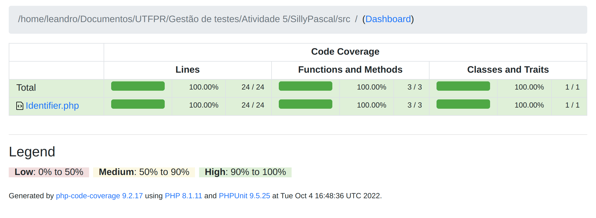
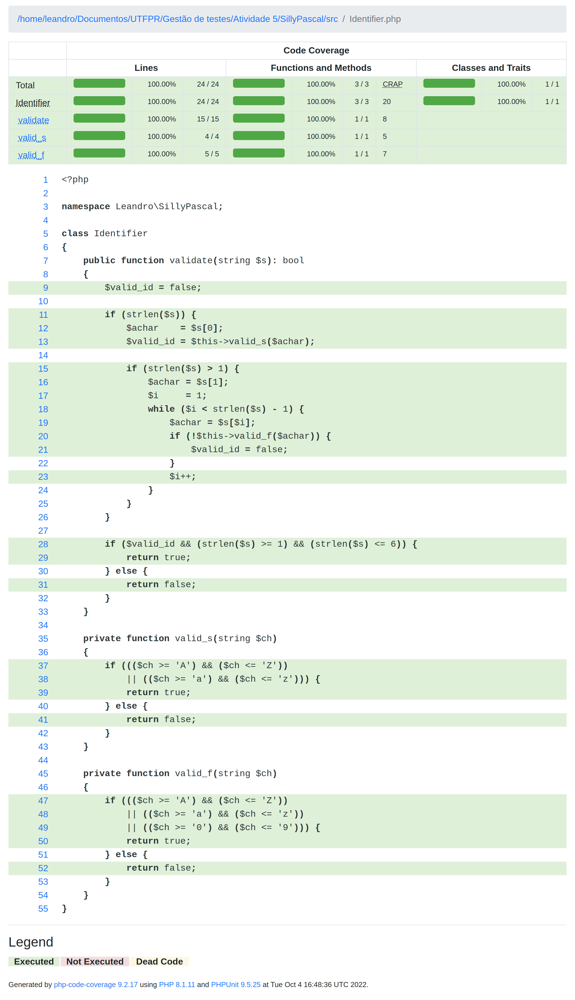
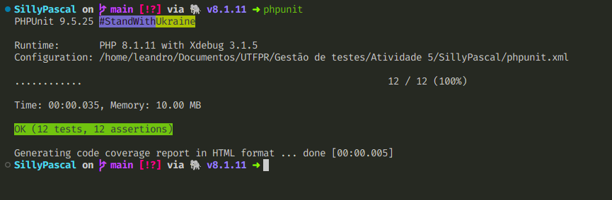

# Entregável 5

Este pacote contém o projeto utilizado na atividade 5 da disciplina **CEES-MBA05 - Planejamento e Gestão de Testes de Software - MBAES_VIII (2022_01)**.

## Objetivos

A seguir está transcrita a descrição da atividade:

> Utilizando a especificação do programa [Identifier.java](./00_extras/Identifier.java) crie casos de teste baseado-se nos seguintes critérios da técnica funcional (use os slides de apoio do moodle):
>
> - Análise de valor limite; e
> - Particionamento em classes de equivalência.
>
> Implemente seus casos de teste usando o programa cedido. Se preferir, pode fazer algo similar em outra liguagem e com outro programa similar. Use o JUnit para testar seu programa (ou ferramentas similares para outras linguagens). Entregue um .ZIP (ou outro arquivo compactado) contendo o projeto e um PDF e relatórios de cobertura. Inclua um arquivo com os nomes de todos os alunos.

## Considações iniciais

O arquivo original, fornecido em Java (disponível [aqui](./00_extras/Identifier.java)), foi convertido para PHP apenas por conveniência. Não foi realizado qualquer tipo de adaptação na tradução, para que eventuais erros que ocorreriam na versão original se repetisse na versão traduzida.

Porém, após a realização dos testes, os devidos ajustes foram realizados no código-fonte para que os testes passassem.

Este código está publicado no [Github](https://github.com/leandrowferreira/UTFPR-Testing).

## As ferramentas

Foi utilizado o [PHPUnit](https://phpunit.de/), a mais difundida ferramenta de testes unitários (e de integração) para o ecossistema PHP. Foi necessário utilizar uma extensão da linguagem chamada [XDEBUG](https://xdebug.org/) para que fosse possível gerar o relatório de cobertura. A IDE utilizada foi o [Visual Studio Code](https://code.visualstudio.com/).

## O relatório de cobertura e o resultado dos testes

Após as correções do código-fonte original, foram gerados os resultados necessários para a conclusão dos testes solicitados na atividade.

### Relatório de cobertura

O PHPUnit gerou, com a ajuda do XDEBUG, o relatório de cobertura disponível no diretório [coverage](./coverage), e os prints estão disponíveis a seguir:

### Resultado

O PHPUnit gerou a saída padrão usando sua CLI, como apresentado abaixo:

